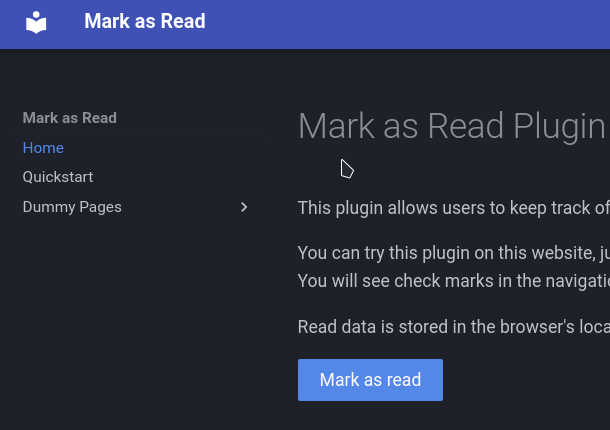

---
mark_as_read:
    updated_at: 2024-03-24
---

# Mark as Read Plugin for Mkdocs Material

This plugin allows users to keep track of their reading progress by marking pages as read.

Preview gif:

Page read data is stored in the browser's local storage, thus it will be available only on the same
device.

You can try this plugin on this website, just click "Mark as read" button at the end of the page.
You will see check marks in the navigation for pages that marked as read.
